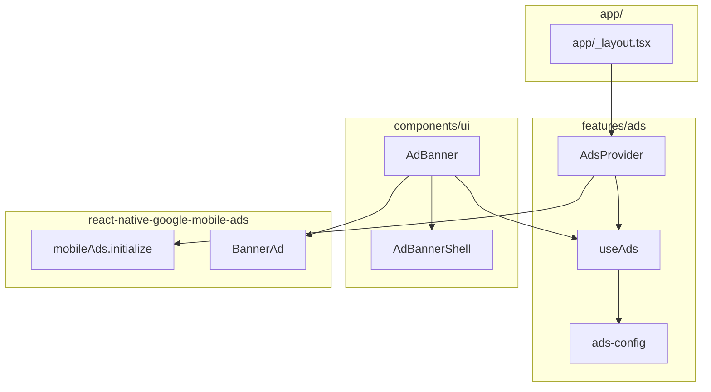

# ads — Design técnico

**Spec**: `.specs/features/ads/spec.md`  
**Status**: Done (2026-05-28)  
**Fontes**: Expo SDK 54 docs (config plugins), Invertase RN Google Mobile Ads docs, código atual `AdBannerShell`.

---

## Architecture Overview

Integração mínima com Google Mobile Ads via `react-native-google-mobile-ads`:

- `features/ads/` encapsula configuração, inicialização e flags.
- `components/ui/AdBanner` renderiza o banner quando disponível; caso contrário mostra `AdBannerShell`.
- Inicialização do SDK acontece uma vez, no root (`app/_layout.tsx`) via `AdsProvider`.

---

## Key decisions

| Decision | Choice | Rationale |
|----------|--------|-----------|
| SDK | `react-native-google-mobile-ads` | Suporta Expo via config plugin; `expo-ads-admob` é deprecated. |
| Formato inicial | Banner apenas | Menor fricção e menor risco de policy/UX. |
| Inicialização | `AdsProvider` no root layout | Evita múltiplas inicializações e centraliza guards. |
| Fallback | Reusar `AdBannerShell` | Mantém layout e design system já previsto. |
| Ambiente | Desativar no Expo Go + web | SDK é nativo; evita crashes/warnings. |

---

## Data / config

### Env vars (public)

- `EXPO_PUBLIC_ADS_ENABLED` (default: `true`)
- `EXPO_PUBLIC_ADMOB_BANNER_UNIT_ID_ANDROID` (default: TestIds)
- `EXPO_PUBLIC_ADMOB_BANNER_UNIT_ID_IOS` (default: TestIds)

### App IDs (native)

O plugin exige **AdMob App ID** por plataforma. Para dev, podemos usar os App IDs de teste do Google:

- Android: `ca-app-pub-3940256099942544~3347511713`
- iOS: `ca-app-pub-3940256099942544~1458002511`

Em produção, substituir pelos App IDs reais do seu app no AdMob.

---

## Component: `AdBanner`

**Location**: `components/ui/AdBanner.tsx`

**Props** (mínimo):

- `placement`: string (ex.: `"today_bottom"`) — para futura instrumentação e múltiplos placements.

**Behavior**:

- Se ads estiverem desabilitados (`enabled=false`) ou não prontos (`ready=false`) → renderiza `AdBannerShell`.
- Se plataforma for web ou app rodando em Expo Go → renderiza `AdBannerShell`.
- Caso contrário → renderiza `BannerAd` com unit id por plataforma.

---

## Provider: `AdsProvider`

**Location**: `features/ads/AdsProvider.tsx`

**Responsabilidade**:

- Rodar `mobileAds().initialize()` uma vez, quando `enabled` e em iOS/Android fora do Expo Go.
- Expor estado via context/hook: `{ enabled, ready }`.

---

## Integration points

| Point | File | Change |
|------|------|--------|
| Root init | `app/_layout.tsx` | Envolver `ThemeProvider` com `AdsProvider` |
| Today banner | `features/today/TodayScreen.tsx` | Trocar `AdBannerShell` por `AdBanner` |
| UI exports | `components/ui/index.ts` | Exportar `AdBanner` |

---

## Error handling strategy

| Scenario | Handling | User impact |
|---------|----------|-------------|
| SDK não disponível (Expo Go / web) | skip init + fallback | layout preservado |
| Falha em initialize | log (dev) + fallback | sem crash |
| Falha no load do banner | fallback | sem bloqueio |

---

## Verification checklist

- [x] `npm run gate` passa (lint + typecheck)
- [ ] Build dev EAS Android/iOS inicia sem crash com App IDs configurados *(smoke — [verification.md](verification.md))*
- [ ] Banner aparece na Today com TestIds *(smoke)*
- [x] Expo Go / Web: banner não tenta inicializar SDK e não crasha

