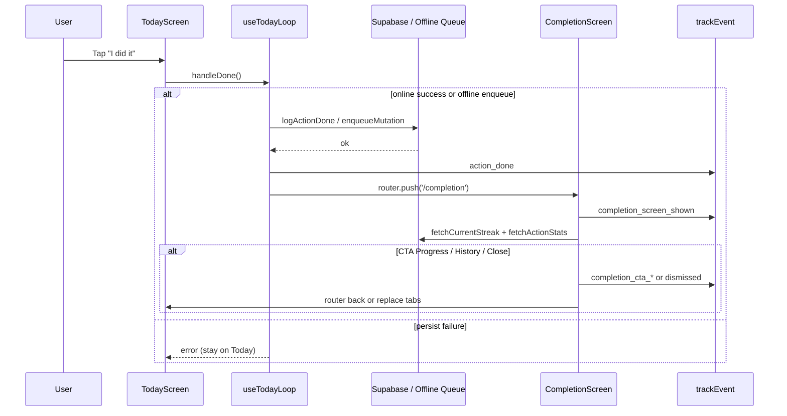
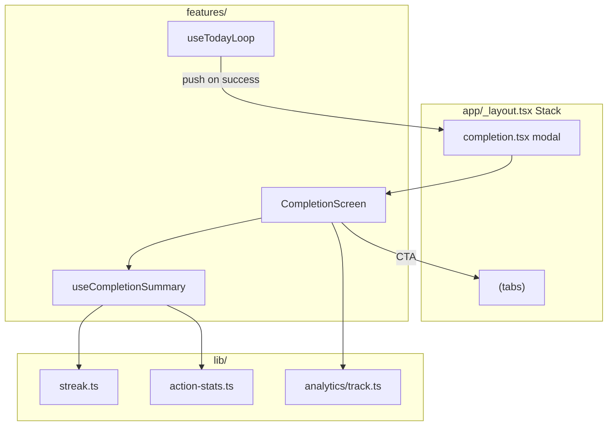

# completion-screen — Design técnico

**Spec**: `.specs/features/completion-screen/spec.md`  
**Status**: Done — Execute concluído (gate 2026-05-26)  
**Fontes**: `kindspark-design-system.md` §7, código Today/Progress, `.specs/TESTING.md`

---

## Architecture Overview

Nova rota **modal no root stack**, acionada por `useTodayLoop` após persistência válida de `done`. A tela busca streak + stats no mount (dados frescos pós-conclusão) e oferece CTAs para tabs existentes. Sem migrations; reutiliza Supabase client e padrões UI do redesign.





**Princípio:** mínima alteração no domínio Today; navegação pós-sucesso; Completion Screen autônoma para conteúdo e analytics.

---

## Code Reuse Analysis

### Existing components to leverage

| Component / módulo | Location | How to use |
|--------------------|----------|------------|
| `ScreenShell` | `components/ui/ScreenShell.tsx` | Layout scrollável + safe area |
| `Button` | `components/ui/Button.tsx` | Primary / secondary / text CTAs |
| `AppText` | `components/ui/AppText.tsx` | Headline, labels, stats |
| `Card` | `components/ui/Card.tsx` | Bloco streak / stats summary |
| `Illustration` | `components/ui/Illustration.tsx` | Celebratory art + peach fallback |
| `StreakBadge` / stats copy | `constants/copy.ts`, Progress patterns | Labels "Current streak", "Completed" |
| `fetchCurrentStreak` | `lib/supabase/streak.ts` | Streak pós-done |
| `fetchActionStats` | `lib/supabase/action-stats.ts` | `completed` count (`month`) |
| `useReducedMotion` | `hooks/useReducedMotion.ts` | Desligar confetti |
| `theme/motion.ts` | `duration.celebration: 500` | Duração entrada + partículas |
| `theme/tokens.ts` | cores peach, gradient CTA | Visual warm light |
| `trackEvent` | `lib/analytics/track.ts` | Novos eventos completion_* |
| `useTodayLoop` | `features/today/useTodayLoop.ts` | Hook point pós-persistência |
| `router` | `expo-router` | push / back / replace para tabs |

### Integration points

| System | Integration |
|--------|-------------|
| Expo Router | Nova `Stack.Screen` `completion` com `presentation: 'modal'` |
| Supabase | Read-only streak + stats; write já feito em Today |
| Offline queue | Tratar enqueue como sucesso para navegação (RNF-004) |
| Analytics | Estender `AnalyticsEvent` em `events.ts` |
| Ads (BR-004) | Sem ads na Completion; `AdBannerShell` permanece só na Today |

### Today screen after completion

| Estado atual | Estado alvo |
|--------------|---------------|
| Card inline `completedTitle` / `completedSubtitle` substitui action card | Após Completion, Today mostra estado done **compacto**: caption "Logged for {date}" + sem card de celebração duplicado (`COMP-25`) |
| Sem navegação pós-done | `handleDone` faz `router.push('/completion')` |

---

## Navegação (Expo Router)

### Rotas

```
app/
  _layout.tsx          # + Stack.Screen name="completion" presentation modal
  completion.tsx       # thin → features/completion/CompletionScreen
  (tabs)/
    index.tsx          # Today (retorno após dismiss)
    progress.tsx
    history.tsx
```

### Registro no root stack

```typescript
// app/_layout.tsx — adicionar
<Stack.Screen
  name="completion"
  options={{
    presentation: 'modal',
    animation: 'fade',
    headerShown: false,
  }}
/>
```

### Navegação a partir de `handleDone`

```typescript
import { router } from 'expo-router';

// Após setTodayDone (online ou pending offline) — ambos os caminhos de sucesso:
router.push('/completion');
```

**Não navegar quando:** `doneError` sem enqueue; skip; busy cancelado.

### CTAs na Completion Screen

| Ação | Navegação |
|------|-----------|
| See my progress | `router.replace('/(tabs)/progress')` — evita stack modal preso |
| See history | `router.replace('/(tabs)/history')` |
| Close | `router.back()` → retorna à Today (modal dismiss) |

### Route guard

`CompletionScreen` on mount: se `useTodayLoop` / leitura rápida de `todayDone` não estiver disponível globalmente, usar param opcional `actionDate` passado na push OU verificar AsyncStorage cache / refetch `fetchTodayDone`. **Decisão:** passar `actionDate` e `offline` via `router.push({ pathname: '/completion', params: { actionDate: today, offline: String(isOffline) } })` para guard e analytics sem estado global novo.

---

## Components

### `useCompletionSummary`

- **Purpose**: Carregar streak + stats para a Completion Screen com loading/error degradável.
- **Location**: `features/completion/useCompletionSummary.ts`
- **Interfaces**:
  - Retorno: `{ streak: number | null; completedCount: number | null; loading: boolean; error: string | null }`
- **Dependencies**: `fetchCurrentStreak`, `fetchActionStats('month')`
- **Reuses**: Padrão de `useProgress.ts` (fetch paralelo, erro não bloqueia UI)

```typescript
export function useCompletionSummary() {
  // useEffect on mount: Promise.all([fetchCurrentStreak(), fetchActionStats('month')])
  // On partial failure: keep available fields; error only if both fail
}
```

### `CompletionScreen`

- **Purpose**: UI da tela de conclusão — celebração, resumo, CTAs, analytics lifecycle.
- **Location**: `features/completion/CompletionScreen.tsx`
- **Interfaces**:
  - Props: `{ actionDate: string; offline?: boolean }` (de route params)
- **Dependencies**: `useCompletionSummary`, `CelebrationBurst`, `copy.completion`, `trackEvent`
- **Reuses**: `ScreenShell`, `Button`, `AppText`, `Card`, `Illustration`

**Layout (design system §7):**

```
┌─────────────────────────────┐
│     [CelebrationBurst]      │
│     [Illustration]          │
│     Amazing ✨              │
│     {rotating subtitle}     │
│  ┌─────────────────────┐    │
│  │ Current streak: N   │    │
│  │ Completed: M        │    │
│  └─────────────────────┘    │
│  [ See my progress ]        │
│  [ See history ]            │
│  Close                      │
└─────────────────────────────┘
```

### `CelebrationBurst`

- **Purpose**: Partículas/confetti sutis com Reanimated; desligado com reduce motion.
- **Location**: `components/ui/CelebrationBurst.tsx`
- **Interfaces**: `{ active?: boolean }` — auto-run on mount when active
- **Dependencies**: `react-native-reanimated`, `useReducedMotion`, `theme/motion`
- **Reuses**: Mesmo stack de animação do `Button` press scale

**Implementação:** 8–12 `View` circulares pequenos (cores peach/laranja/verde suave), animação translateY + opacity 500ms, `pointerEvents="none"`. Sem nova dependência (sem Lottie/confetti lib).

### `pickCelebrationMessage`

- **Purpose**: Rotacionar subtítulos positivos determinísticos por `actionDate` (mesmo dia = mesma mensagem).
- **Location**: `features/completion/pick-celebration-message.ts`
- **Reuses**: Lista em `copy.completion.messages[]`

---

## Data Models

Sem novos modelos de banco. Tipos existentes:

```typescript
// Já existentes — apenas consumo
type UserActionLog = { action_date: string; status: 'done' | 'skipped'; ... };
type ActionStats = { completed: number; skipped: number; completionRate: number };
```

**Route params (local):**

```typescript
type CompletionRouteParams = {
  actionDate: string; // YYYY-MM-DD local
  offline?: 'true' | 'false';
};
```

---

## Analytics

Estender `lib/analytics/events.ts`:

```typescript
| 'completion_screen_shown'
| 'completion_screen_dismissed'
| 'completion_cta_progress'
| 'completion_cta_history'
```

**CompletionScreen lifecycle:**

1. `useRef` timestamp no mount → `completion_screen_shown`
2. On CTA → evento específico + `duration_ms` → navegação
3. On Close / `beforeRemove` → `completion_screen_dismissed` com `duration_ms`

Manter `action_done` em `useTodayLoop` (evento existente); completion events são camada adicional pós-navegação.

---

## Error Handling Strategy

| Cenário | Handling | User Impact |
|---------|----------|-------------|
| `logActionDone` falha (rede) | Enqueue offline → push completion | Tela normal + offline flag |
| `logActionDone` falha (outro) | Error na Today, sem push | Mensagem warning |
| Streak fetch falha | `streak: null`, show generic success | Sem número de streak |
| Stats fetch falha | `completedCount: null` | Sem total completed |
| Ambos falham | Headline + CTAs only | Degraded but positive |
| Deep link `/completion` sem done | `router.replace('/(tabs)')` | Redirect silencioso |
| Stats loading | Skeleton ou omit section | Sem spinner bloqueante |

---

## Tech Decisions

| Decision | Choice | Rationale |
|----------|--------|-----------|
| Onde vive a rota | Root stack modal `app/completion.tsx` | Overlay sobre tabs; dismiss natural; alinhado a design system "soft modal transition" |
| Quando navegar | Dentro de `handleDone` após sucesso | Único hook point; cobre online + offline enqueue |
| Dados na tela | Refetch on mount | Streak atualizado pós-insert; evita stale header badge |
| Params vs global store | Route params `actionDate`, `offline` | Sem novo context provider; guard simples |
| Confetti | Reanimated particles in-house | Zero deps; `duration.celebration` já definido |
| Today completed card | Remover card celebratório inline | Evita dupla recompensa; mantém caption logged |
| CTA navigation | `router.replace` para tabs | Usuário não fica preso atrás do modal no stack |
| Weekly progress | Deferred (`COMP-23`) | Não existe query semanal; P3 opcional |
| Copy | Inglês em `copy.completion` | Consistência redesign-ui / design system |
| Milestone celebration | Permanece em Progress | Completion não duplica RF-008; milestone card unchanged |

---

## Arquivos novos / modificados (Execute)

| Arquivo | Ação |
|---------|------|
| `app/_layout.tsx` | Registrar screen modal |
| `app/completion.tsx` | Nova rota thin |
| `features/completion/CompletionScreen.tsx` | Nova tela |
| `features/completion/useCompletionSummary.ts` | Novo hook |
| `features/completion/pick-celebration-message.ts` | Helper copy |
| `features/completion/index.ts` | Barrel export |
| `components/ui/CelebrationBurst.tsx` | Animação |
| `components/ui/index.ts` | Export CelebrationBurst |
| `constants/copy.ts` | Seção `completion` |
| `lib/analytics/events.ts` | Novos eventos |
| `features/today/useTodayLoop.ts` | push após sucesso + params |
| `features/today/TodayScreen.tsx` | Simplificar estado done pós-completion |

---

## Verificação de design (pré-Execute)

- [ ] Modal não exige alteração em `(tabs)/_layout.tsx` guards
- [ ] Offline path em `handleDone` (linhas ~155–167 e ~176–188) também chama push
- [ ] Skip path (~205+) nunca chama push
- [ ] `npm run gate` após implementação (sem testes unitários — `.specs/TESTING.md`)
