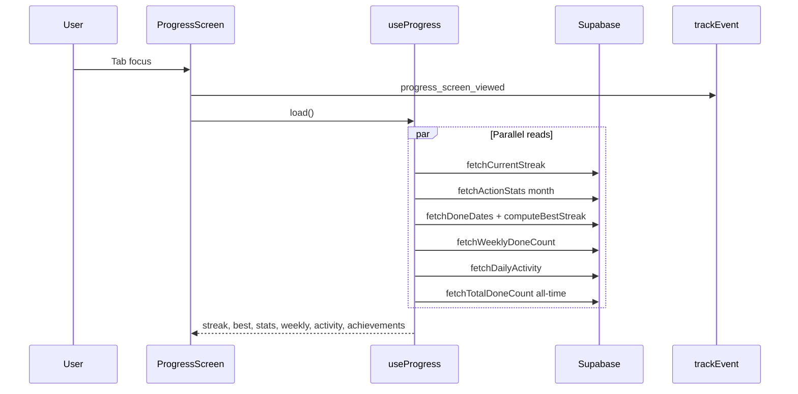

# progress-history — Design técnico

**Spec**: `.specs/features/progress-history/spec.md`  
**Status**: Done — implementado + gate (2026-05-27)  
**Fontes**: código Progress/History atual, `lib/supabase/*`, `lib/streak/*`, `.specs/TESTING.md`

---

## Architecture Overview

Evolução **read-only** das tabs Progress e History: novas funções Supabase + helpers de streak/semana, componentes UI reutilizáveis, extensão dos hooks existentes. Sem migrations; sem alterar writes de Today.

```mermaid
flowchart TB
  subgraph tabs [app/(tabs)]
    PROG[progress.tsx]
    HIST[history.tsx]
  end

  subgraph features [features/]
    PS[ProgressScreen]
    UP[useProgress]
    HS[HistoryScreen]
    UH[useHistory]
  end

  subgraph ui [components/ui]
    SR[StatsRow]
    AC[ActivityCalendar]
    HFB[HistoryFilterBar]
    HR[HistoryRow]
    LAB[LightAchievementRow]
  end

  subgraph lib [lib/]
    ST[streak.ts + compute-streak]
    AS[action-stats.ts]
    AH[action-history.ts]
    DA[daily-activity.ts NEW]
    ACH[light-achievements.ts NEW]
    AN[analytics/events.ts]
  end

  PROG --> PS --> UP
  HIST --> HS --> UH
  UP --> ST
  UP --> AS
  UP --> DA
  UP --> ACH
  UH --> AH
  PS --> SR
  PS --> AC
  PS --> LAB
  HS --> HFB
  HS --> HR
  PS --> AN
  HS --> AN
```



**Princípio:** estender antes de reescrever — `useProgress` / `useHistory` mantêm API familiar; novos campos opcionais com degradação parcial (padrão `useCompletionSummary`).

---

## Code Reuse Analysis

### Existing components to leverage

| Component / módulo | Location | How to use |
|--------------------|----------|------------|
| `ProgressScreen` | `features/progress/ProgressScreen.tsx` | Adicionar seções: best streak, weekly, calendar, light achievements |
| `useProgress` | `features/progress/useProgress.ts` | Estender `load()` com fetches paralelos |
| `StatsRow` | `components/ui/StatsRow.tsx` | Stats mensais (já integrado) |
| `AchievementBadge` + `STREAK_MILESTONES` | `components/ui`, `lib/streak/milestones.ts` | Manter milestones 3/7/14/30 (PH-22) |
| `HistoryScreen` + `FlatList` | `features/history/HistoryScreen.tsx` | Filtros no header + `onEndReached` |
| `HistoryRow` | `components/ui/HistoryRow.tsx` | BR-003 já atendido; sem mudança obrigatória |
| `fetchCurrentStreak` / `fetchDoneDates` | `lib/supabase/streak.ts` | Current + input para best streak |
| `computeStreak` | `lib/streak/compute-streak.ts` | Reutilizar para best streak scan |
| `fetchActionStats` | `lib/supabase/action-stats.ts` | Mês corrente |
| `fetchActionHistory` | `lib/supabase/action-history.ts` | Estender com filtros + cursor |
| `ScreenShell`, `Card`, `AppText`, `Button` | `components/ui/*` | Layout e empty/error |
| `trackEvent` | `lib/analytics/track.ts` | Novos eventos PH-17…21 |
| `copy.progress` / `copy.history` | `constants/copy.ts` | Novas strings EN |

### Integration points

| System | Integration |
|--------|-------------|
| Supabase | Queries em `user_action_logs` + join `actions` (histórico) |
| Expo Router | `useFocusEffect` para screen viewed + reload |
| Analytics | Estender `AnalyticsEvent` union |
| Completion Screen | CTAs já navegam para tabs — sem mudança obrigatória |

---

## Data layer

### Best streak (`computeBestStreak`)

Scan sobre datas `done` distintas (mesmo dataset de `fetchDoneDates`, lookback **365 dias** ou `all` via query sem limite inferior se performance OK).

```typescript
// lib/streak/compute-best-streak.ts
export function computeBestStreak(doneDates: Iterable<string>): number {
  const sorted = [...new Set(doneDates)].sort(); // ascending YYYY-MM-DD
  if (sorted.length === 0) return 0;
  let best = 1;
  let run = 1;
  for (let i = 1; i < sorted.length; i++) {
    const prev = sorted[i - 1];
    const next = addDaysToDateString(prev, 1);
    if (sorted[i] === next) {
      run += 1;
      best = Math.max(best, run);
    } else {
      run = 1;
    }
  }
  return best;
}
```

Exportar `fetchBestStreak(today?)` em `streak.ts` que reutiliza `fetchDoneDates` com `LOOKBACK_DAYS = 365`.

### Weekly summary

```typescript
// lib/supabase/weekly-progress.ts
export type WeeklyProgress = {
  doneDays: number;
  totalDays: 7;
  weekStart: string; // YYYY-MM-DD
  weekEnd: string;
};

/** Segunda-feira como início da semana (locale US comum em apps EN) */
export function getLocalWeekBounds(date: Date = new Date()): { start: string; end: string }

export async function fetchWeeklyDoneCount(
  today?: string,
): Promise<{ data: WeeklyProgress | null; error: Error | null }>
```

Query: `user_action_logs` com `status = 'done'`, `action_date` entre `weekStart` e `min(today, weekEnd)`.

### Daily activity (heatmap)

```typescript
// lib/supabase/daily-activity.ts
export type DayActivityStatus = 'done' | 'skipped' | 'none';

export type DailyActivityCell = {
  action_date: string;
  status: DayActivityStatus;
};

const CALENDAR_DAYS = 35; // 5 semanas × 7 colunas

export async function fetchDailyActivity(
  today: string = toLocalDateString(),
  days: number = CALENDAR_DAYS,
): Promise<{ data: DailyActivityCell[]; error: Error | null }>
```

Agregação: para cada `action_date` no range, se qualquer `done` → `done`; senão se qualquer `skipped` → `skipped`; senão `none`. Ordenar ascendente para grid left-to-right, top-to-bottom.

### Total done (achievements)

```typescript
// lib/supabase/action-stats.ts — adicionar
export async function fetchTotalDoneCount(): Promise<{ count: number; error: Error | null }>
```

`select` com `count` head ou agregação client-side limitada — preferir `count: 'exact'` Supabase.

### Light achievements

```typescript
// lib/streak/light-achievements.ts
export type LightAchievementId = 'first_done' | 'streak_7' | 'completed_30';

export type LightAchievement = {
  id: LightAchievementId;
  unlocked: boolean;
};

export function computeLightAchievements(input: {
  totalDone: number;
  currentStreak: number;
  bestStreak: number;
}): LightAchievement[]
```

Regras PH-07; labels em `copy.progress.lightAchievements`.

### History pagination + filters

```typescript
// lib/supabase/action-history.ts — estender
export type HistoryFilter =
  | 'all'
  | 'done'
  | 'skipped'
  | 'last_7_days'
  | 'last_30_days';

export type FetchActionHistoryParams = {
  limit?: number;
  cursor?: string; // created_at ou id do último item
  filter?: HistoryFilter;
};

export async function fetchActionHistory(
  params?: FetchActionHistoryParams,
): Promise<{
  data: ActionHistoryEntry[];
  nextCursor: string | null;
  error: Error | null;
}>
```

- `HISTORY_PAGE_SIZE = 25`
- Filtros `done`/`skipped` → `.eq('status', …)`
- `last_7_days` / `last_30_days` → `.gte('action_date', fromDate)`
- Cursor: `created_at` + `id` do último row (desempate estável)
- Manter join com `actions` e skip de órfãos (PH-15)

---

## Components

### `ActivityCalendar`

- **Purpose**: Grid 7 colunas × 5 linhas de células com cor por status.
- **Location**: `components/ui/ActivityCalendar.tsx`
- **Interfaces**:
  - Props: `{ cells: DailyActivityCell[]; onDayPress?: (date: string, status: DayActivityStatus) => void }`
- **Dependencies**: `theme/tokens` — `success` (done), muted border (skipped), `background` (none)
- **Reuses**: Padrão de toque mínimo 44×44 via `Pressable` com hitSlop

### `HistoryFilterBar`

- **Purpose**: Chips horizontais para os 5 filtros.
- **Location**: `components/ui/HistoryFilterBar.tsx`
- **Interfaces**: `{ value: HistoryFilter; onChange: (f: HistoryFilter) => void }`
- **Reuses**: Estilo chip similar a tabs secundárias do design system (peach active)

### `LightAchievementRow`

- **Purpose**: Lista horizontal de 3 badges leves (ícone + label curto).
- **Location**: `components/ui/LightAchievementRow.tsx` ou seção inline em Progress
- **Reuses**: `AchievementBadge` visual language; estados locked/unlocked

### `useProgress` (extended)

Retorno alvo:

```typescript
{
  today: string;
  streak: number;
  bestStreak: number;
  busy: boolean;
  error: string | null;
  stats: ActionStats | null;
  weekly: WeeklyProgress | null;
  activity: DailyActivityCell[];
  lightAchievements: LightAchievement[];
  milestoneMessage: string | null;
  nextMilestone: number | null;
  load: () => Promise<void>;
  isEmptyJourney: boolean; // nenhum done ever
}
```

**Load strategy:** `Promise.all` com tratamento parcial — erro em streak bloqueia hero; demais seções falham silenciosamente.

### `useHistory` (extended)

```typescript
{
  entries: ActionHistoryEntry[];
  filter: HistoryFilter;
  setFilter: (f: HistoryFilter) => void;
  busy: boolean;
  loadingMore: boolean;
  error: string | null;
  hasMore: boolean;
  load: () => Promise<void>;
  loadMore: () => Promise<void>;
}
```

`setFilter` reseta lista e refetch página 1; emite `history_filter_changed`.

---

## Progress Screen layout (alvo)

```
┌─────────────────────────────┐
│ Your progress               │
│ ┌─ Current streak ─────────┐│
│ │  🔥  N days              ││
│ │  Best: M days            ││
│ └──────────────────────────┘│
│ [ empty journey CTA ]       │  ← se isEmptyJourney
│ Weekly: 5 of 7 days…        │
│ [ StatsRow completed/skip ] │
│ [ ActivityCalendar 5×7 ]    │
│ Achievements (milestones)   │  ← existente STREAK_MILESTONES
│ Light achievements row    │  ← PH-07
│ [ milestone card ]          │
└─────────────────────────────┘
```

---

## History Screen layout (alvo)

```
┌─────────────────────────────┐
│ History                     │
│ [All][Done][Skipped][7d][30d]│
│ ┌ HistoryRow ─────────────┐ │
│ │ …                       │ │
│ └─────────────────────────┘ │
│ (footer loader / empty)     │
└─────────────────────────────┘
```

`FlatList` mantém virtualização nativa (BR-004); paginação via `onEndReached` → `loadMore`.

---

## Analytics

Estender `lib/analytics/events.ts`:

```typescript
| 'progress_screen_viewed'
| 'history_screen_viewed'
| 'achievement_viewed'
| 'history_filter_changed'
| 'calendar_day_tapped'
```

| Tela | Hook | Evento |
|------|------|--------|
| Progress | `useFocusEffect` em `ProgressScreen` | `progress_screen_viewed` |
| History | `useFocusEffect` em `HistoryScreen` | `history_screen_viewed` |
| History | `setFilter` | `history_filter_changed` |
| Progress | `ActivityCalendar` onPress | `calendar_day_tapped` |
| Progress | tap light achievement unlocked | `achievement_viewed` |

---

## Error Handling Strategy

| Cenário | Handling | User Impact |
|---------|----------|-------------|
| Streak fetch falha | `error` + retry | Card streak com mensagem |
| Stats falha | `stats: null` | Omit StatsRow |
| Weekly falha | `weekly: null` | Omit linha semanal |
| Activity falha | `activity: []` | Omit calendário |
| History page 2 falha | Manter página 1 + toast/retry footer | Scroll preservado |
| Filtro sem resultados | `copy.history.emptyFilter` | Empty amigável |
| Log órfão | Skip row | Lista estável |

---

## Tech Decisions

| Decision | Choice | Rationale |
|----------|--------|-----------|
| Best streak lookback | 365 dias | Balance performance vs precisão; configurável constante |
| Semana local | Segunda início | Padrão ISO comum; documentar em copy |
| Heatmap tamanho | 35 dias (5×7) | Cabe em mobile sem scroll horizontal excessivo |
| Milestones vs light achievements | Coexistem em seções distintas | PH-22 — não remover RF-008 milestones |
| History paginação | Cursor + page size 25 | BR-004; melhor que único limit 50 |
| Filtros | Server-side query | Escala com usuários longos |
| Stats período | Mês (existente) | Alinhado a `fetchActionStats('month')` |
| Copy | Inglês `copy.progress` / `copy.history` | Consistência redesign |
| Categoria no row | Manter ícone via `getCategoryVisual` | Já suportado em `HistoryRow` |

---

## Arquivos novos / modificados (Execute)

| Arquivo | Ação |
|---------|------|
| `lib/streak/compute-best-streak.ts` | Novo |
| `lib/supabase/weekly-progress.ts` | Novo |
| `lib/supabase/daily-activity.ts` | Novo |
| `lib/streak/light-achievements.ts` | Novo |
| `lib/supabase/streak.ts` | `fetchBestStreak` |
| `lib/supabase/action-stats.ts` | `fetchTotalDoneCount` |
| `lib/supabase/action-history.ts` | Filtros + cursor |
| `lib/supabase/index.ts` | Exports |
| `components/ui/ActivityCalendar.tsx` | Novo |
| `components/ui/HistoryFilterBar.tsx` | Novo |
| `components/ui/LightAchievementRow.tsx` | Novo (ou inline) |
| `components/ui/index.ts` | Exports |
| `constants/copy.ts` | Novas strings |
| `lib/analytics/events.ts` | 5 eventos |
| `features/progress/useProgress.ts` | Extend load |
| `features/progress/ProgressScreen.tsx` | Novas seções + analytics |
| `features/history/useHistory.ts` | Filtros + paginação |
| `features/history/HistoryScreen.tsx` | FilterBar + loadMore |

---

## Verificação de design (pré-Execute)

- [x] `fetchDoneDates` lookback suficiente para best streak ou aumentar constante
- [x] Paginação não quebra `keyExtractor` (`id` único)
- [x] Filtro + cursor resetam juntos em `setFilter`
- [x] `npm run gate` após implementação
- [x] Smoke: Completion CTAs → Progress/History com novas seções
