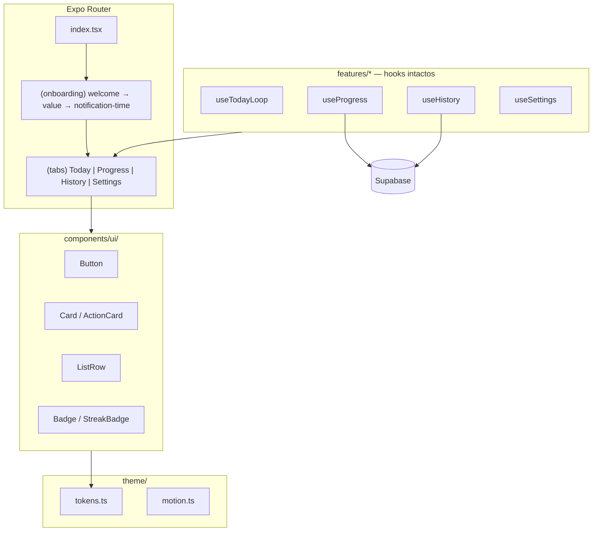

# redesign-ui — Design técnico

**Spec**: `.specs/features/redesign-ui/spec.md`  
**Status**: Draft  
**Fontes**: `kindspark-design-system.md`, mockup (layout only), código MVP v0.1

---

## Architecture Overview

Redesign **presentation-only**: tokens + componentes UI + refatoração de telas. Hooks de domínio (`useTodayLoop`, `useProgress`, `useHistory`, `useSettings`) e APIs Supabase permanecem; apenas **extensões read-only** onde a UI exige dados ainda não expostos (métricas de Progress).



**Princípio:** telas importam `@/components/ui/*` + `@/theme/*`; não duplicar hex/radius em `StyleSheet` por tela.

---

## Code Reuse Analysis

### Existing components to leverage

| Component / módulo | Location | How to use |
|--------------------|----------|------------|
| Feature screens | `features/today/TodayScreen.tsx`, etc. | Refatorar JSX/styles; manter hooks |
| `useTodayLoop` | `features/today/useTodayLoop.ts` | Sem mudança de assinatura (`RUI-TD-07`) |
| `useHistory` | `features/history/useHistory.ts` | Sem mudança; novo formatter de data relativa em `lib/format/` |
| `useSettings` | `features/settings/useSettings.ts` | Sem mudança; UI consome mesmo estado |
| `useProgress` | `features/progress/useProgress.ts` | Estender retorno com `stats` (campos novos, não breaking) |
| `fetchActionHistory` | `lib/supabase/action-history.ts` | History rows |
| `fetchCurrentStreak` | `lib/supabase/streak.ts` | Streak card |
| `getActiveMilestone` / badges | `lib/streak/milestones.ts` | Achievement states |
| `AppSessionProvider` | `features/auth/AppSessionProvider.tsx` | Nome do usuário via `session.user` |
| `LoadingScreen` | `components/LoadingScreen.tsx` | Estados busy |
| `expo-router` tabs | `app/(tabs)/_layout.tsx` | Custom tab bar theme |
| `react-native-reanimated` | já instalado | Press scale, tab fade (~250ms) |
| `expo-font` | `app/_layout.tsx` | Carregar Inter |

### Deprecate / migrate (não remover de uma vez)

| Legado | Ação |
|--------|------|
| `constants/Colors.ts` (azul frio + dark) | Substituir por `theme/tokens.ts`; `Colors.ts` re-exporta tokens light por compat (`CA-DS-02`) |
| `components/Themed.tsx` | Migrar para variantes `AppText` / `ScreenShell` em `components/ui/` |
| `useColorScheme` em telas em escopo | Forçar paleta **warm light** (ver Tech Decisions) |

### Integration points

| System | Integration |
|--------|-------------|
| Supabase | Nova query agregada para stats de Progress (ver Data layer) |
| Onboarding guard | `getAppEntryHref` + stack `(onboarding)` ganham rotas `welcome` e `value` |
| Analytics | Sem novos eventos; telas continuam `trackEvent` existente |
| Notifications | `notification-time.tsx` só recebe skin DS (fora do escopo OB-1/2, mas mesmo stack) |

---

## Navegação (Expo Router)

### Fluxo atual → alvo

```
(auth)/login|register
        ↓
(onboarding)/welcome          ← NOVO (RUI-OB-01…04)
        ↓
(onboarding)/value            ← NOVO (RUI-OB-05…08)
        ↓
(onboarding)/notification-time  (existente, visual alinhado leve)
        ↓
(tabs)/index | progress | history | settings
```

### Arquivos de rota

```
app/
  (onboarding)/
    _layout.tsx              # Stack headerShown: false nas novas telas
    welcome.tsx              # thin → features/onboarding/WelcomeScreen
    value.tsx                # thin → features/onboarding/ValueScreen
    notification-time.tsx    # restyle opcional mínimo
  (tabs)/
    _layout.tsx              # tabBarStyle + activeTint laranja
```

### Mudanças de routing

```typescript
// features/auth/routing.ts — antes
if (onboardingComplete === false) return '/(onboarding)/notification-time';

// depois
if (onboardingComplete === false) return '/(onboarding)/welcome';
```

`hasCompletedOnboarding` **não** muda: OB-1/2 são apenas apresentação; conclusão continua ao salvar `notification_preferences`.

### Onboarding layout

- `welcome` e `value`: `headerShown: false`, fundo `#F8F5F0`, safe area.
- `notification-time`: pode manter header mínimo ou esconder para consistência (decisão Execute: preferir `headerShown: false` + título in-screen).

---

## Theme layer (`theme/`)

### `theme/tokens.ts`

Espelha `kindspark-design-system.md` — única fonte de valores para UI nova.

```typescript
export const colors = {
  background: '#F8F5F0',
  card: '#FFFFFF',
  peach: '#FFE8D8',
  textPrimary: '#1F1F1F',
  textSecondary: '#6D6D6D',
  textMuted: '#9A9A9A',
  ctaStart: '#FF8A3D',
  ctaEnd: '#FF6A21',
  success: '#2E9E5B',
  warning: '#E89C2D',
  accentYellow: '#FFC94A',
  accentGreen: '#77C48C',
  overlay: 'rgba(0,0,0,0.35)',
} as const;

export const spacing = [4, 8, 12, 16, 20, 24, 32, 40, 48] as const;
export const screenPadding = { horizontal: 20, vertical: 16 } as const;

export const radius = {
  card: 20,
  primary: 24,
  modal: 28,
  input: 18,
  mini: 16,
  pill: 999,
} as const;

export const shadows = {
  card: { /* 0 8 30 0.06 */ },
  cta: { /* 0 10 20 rgba(255,106,33,0.22) */ },
  modal: { /* 0 20 60 0.18 */ },
} as const;
```

### `theme/typography.ts`

| Variant | size | weight | color token | Maps to |
|---------|------|--------|-------------|---------|
| `hero` | 32 | 700 | textPrimary | — |
| `title` | 24 | 700 | textPrimary | Screen titles |
| `section` | 20 | 600 | textPrimary | — |
| `cardTitle` | 18 | 700 | textPrimary | Action card title |
| `body` | 16 | 400 | textPrimary | — |
| `bodySecondary` | 16 | 400 | textSecondary | Descriptions |
| `caption` | 12 | 500 | textMuted | Tab labels, meta |
| `micro` | 10 | 500 | textMuted | — |

Componente: `AppText variant="title"`.

### `theme/motion.ts`

```typescript
export const duration = { fast: 150, default: 250, soft: 350, celebration: 500 } as const;
```

Hook `useReducedMotion()` → desliga scale/bounce; mantém fade.

### Font loading (`app/_layout.tsx`)

```typescript
import { Inter_400Regular, Inter_500Medium, Inter_600SemiBold, Inter_700Bold } from '@expo-google-fonts/inter';

useFonts({
  Inter_400Regular,
  Inter_500Medium,
  Inter_600SemiBold,
  Inter_700Bold,
  ...FontAwesome.font,
});
```

**Dependência nova:** `@expo-google-fonts/inter` (padrão Expo; alinhado a `RUI-DS-02`).

---

## Component library (`components/ui/`)

### `ScreenShell`

- **Purpose**: Safe area + fundo `colors.background` + padding horizontal 20.
- **Location**: `components/ui/ScreenShell.tsx`
- **Props**: `children`, `scrollable?: boolean`, `contentContainerStyle?`
- **Reuses**: `SafeAreaView` from `react-native-safe-area-context`

### `Button`

- **Purpose**: CTAs Primary / Secondary / Ghost / Text (`RUI-CMP-01`)
- **Variants**:

| Variant | Visual | Min height |
|---------|--------|------------|
| `primary` | Gradiente laranja, texto branco, pill, shadow cta | 48 |
| `secondary` | Borda `#FF6A21`, fundo transparente | 48 |
| `ghost` | Sem borda, texto primary | 44 |
| `text` | Texto laranja + ícone opcional | 44 |

- **Press**: `scale(0.98)` via Reanimated, 150ms, disabled quando `loading`
- **Primary gradient**: `expo-linear-gradient` (ver Tech Decisions)

### `Card` / `ActionCard`

- **Card**: fundo branco, `radius.card`, `shadows.card`
- **ActionCard** (`RUI-TD-02`):
  - Top: `height ~40%`, `backgroundColor: peach`, `Illustration` center
  - Bottom: padding 16–20, `cardTitle` + `bodySecondary`
  - Prop `illustrationSource` | `illustrationPlaceholder`

### `StreakBadge` / `AchievementBadge`

- **StreakBadge**: flame icon + número, pill peach ou inline header
- **AchievementBadge**: círculo 56px, label `3d`/`7d`/…, estados `locked | active | completed` (`RUI-PR-05`)

### `StatsRow`

- Três colunas flex: label caption + valor semibold (`RUI-PR-03`)

### `HistoryRow`

- Ícone categoria (círculo), título, `formatRelativeDate(action_date)`, status chip
- `done`: círculo `#2E9E5B` + check branco
- `skipped`: círculo muted + ícone diferente (sem verde)

### `ListRow`

- Settings: `icon`, `label`, `value?`, `showChevron`, `onPress?`, `rightElement?` (Switch)
- Altura mínima 52px (`RUI-A11Y-01`)

### `PaginationDots`

- `count={2}`, `activeIndex` — Onboarding (`RUI-OB-07`)

### `TabBar` styling (via `screenOptions`)

Não componente separado inicialmente; configurar em `app/(tabs)/_layout.tsx`:
- `tabBarActiveTintColor: colors.ctaEnd`
- `tabBarInactiveTintColor: colors.textMuted`
- `tabBarStyle`: white bg, rounded top 24, soft shadow (`RUI-NAV-02`, `RUI-NAV-03`)

### `AdBannerShell` (P2)

- View fixa acima da tab bar, altura ~50, fundo muted — sem SDK de ads (`RUI-TD-08`)

---

## Screen designs (composition)

### Onboarding 1 — `WelcomeScreen` (`RUI-OB-*`)

```
┌─────────────────────────┐
│      [Logo KindSpark]   │  AppText hero / brand
│  Small actions can...   │  bodySecondary, center
│                         │
│   [Illustration 240px]  │  assets/onboarding/welcome.png
│                         │
│   [ Get Started ]       │  Button primary
└─────────────────────────┘
```

- **Route**: `/(onboarding)/welcome`
- **Navigate**: `router.push('/(onboarding)/value')`

### Onboarding 2 — `ValueScreen` (`RUI-OB-05…08`)

```
┌─────────────────────────┐
│ A positive habit can... │  title, multiline center
│   [Illustration]        │
│        • ○              │  PaginationDots activeIndex=1
│   [ Continue ]          │
└─────────────────────────┘
```

- **Navigate**: `router.push('/(onboarding)/notification-time')`
- **Back**: hardware back → `welcome` (stack)

### Today — `TodayScreen` refactor (`RUI-TD-*`)

```
┌─────────────────────────┐
│ Good morning, Kaique ☀️ │  AppText section    [🔥 7] StreakBadge
│                         │
│ ┌─────────────────────┐ │
│ │    [illustration]   │ │  ActionCard peach top
│ │─────────────────────│ │
│ │ Title               │ │
│ │ Description         │ │
│ └─────────────────────┘ │
│ [ I did it ✨ ]          │  primary
│ [ Skip ]                │  secondary
│ New idea 🔄             │  text + onPress refresh
│ [offline banner]        │  caption muted
│ [AdBannerShell]         │  optional P2
└─────────────────────────┘
```

**Greeting helper** — `lib/format/greeting.ts`:

```typescript
export function getTimeGreeting(date = new Date()): string {
  const h = date.getHours();
  if (h < 12) return 'Good morning';
  if (h < 17) return 'Good afternoon';
  return 'Good evening';
}
```

**Display name**: `session.user.user_metadata.full_name` ?? email local-part ?? `'friend'`.

**Streak no header**: reutilizar `fetchCurrentStreak` em focus ou expor streak via prop de hook futuro; **v1 design**: chamada leve no screen `useFocusEffect` ou estender `useTodayLoop` com `streakCount` opcional (preferir segundo hook `useStreakBadge` fino para não inflar Today loop).

### Progress — `ProgressScreen` refactor (`RUI-PR-*`)

```
Your progress                 title

┌ Current streak ─────────┐   StatsCard peach
│  🔥   7 days            │
└─────────────────────────┘

Completed | Skipped | Completion rate
   23          4            86%

Achievements          See all >
[3d] [7d] [14d] [30d]   horizontal ScrollView

[milestone message card]      if milestoneMessage
```

### History — `HistoryScreen` refactor (`RUI-HI-*`)

- `FlatList` de `HistoryRow`
- `formatRelativeDate(action_date)` → `"Today" | "Yesterday" | "{n} days ago"`
- Empty: copy EN — *"Your kind moments will show up here."*

### Settings — `SettingsScreen` refactor (`RUI-ST-*`)

| Row | Control | Hook field |
|-----|---------|------------|
| Notifications | Switch | `enabled` / `setEnabled` |
| Reminder Time | Press → picker | `time` / `setTime` |
| Sound | Placeholder chevron | disabled / future |
| Vibration | Placeholder | future |
| Privacy / Terms / About / Rate App | `ListRow` + `Linking.openURL` ou noop |
| Sign out | `Button variant="ghost"` | `signOut` |

Som/Vibração: UI presente com `onPress` undefined ou toast “Coming soon” — satisfaz mock sem backend (`RUI-ST-03`).

---

## Data layer (extensão mínima)

Progress precisa de métricas não expostas hoje. **Não altera** regras de streak.

### `lib/supabase/action-stats.ts` (novo)

```typescript
export type ActionStats = {
  completed: number;
  skipped: number;
  completionRate: number; // 0–100, done / (done + skipped) no período
};

export async function fetchActionStats(
  period: 'month' | 'all' = 'month',
): Promise<{ data: ActionStats | null; error: Error | null }>;
```

- **month**: logs do mês calendário local (`action_date` filter)
- **completionRate**: `done / (done + skipped) * 100`, ou `0` se denominador 0

### `useProgress` extension

```typescript
return {
  // existing
  streak,
  busy,
  error,
  milestoneMessage,
  nextMilestone,
  load,
  // new
  stats: { completed, skipped, completionRate } | null,
};
```

`load()` chama `fetchCurrentStreak` + `fetchActionStats` em paralelo (`Promise.all`).

**Traceability**: `RUI-PR-03`, `RUI-PR-07` (lógica de streak intacta; apenas UI consome stats).

---

## Assets (`assets/`)

| Asset | Path | Used in |
|-------|------|---------|
| Welcome illustration | `assets/illustrations/onboarding-welcome.png` | OB-1 |
| Value illustration | `assets/illustrations/onboarding-value.png` | OB-2 |
| Action placeholder | `assets/illustrations/action-heart.png` | Today card (até ilustração por categoria) |
| Empty history | `assets/illustrations/empty-history.png` | History empty |

**Fase 1 Execute**: placeholders sólidos `#FFE8D8` + emoji/ícone; substituir PNG quando art final (`RUI-AST-01`).

`expo-image` opcional para cache; se não adicionar dep, `Image` RN nativo.

---

## Copy & i18n (`RUI-COPY-01`)

- Todas as strings de UI em **inglês** — centralizar em `constants/copy.ts` (ou `theme/copy.ts`):

```typescript
export const copy = {
  onboarding: {
    welcomeSubtitle: 'Small actions can create big change.',
    getStarted: 'Get Started',
    valueHeadline: 'A positive habit can transform your day.',
    continue: 'Continue',
  },
  today: {
    didIt: 'I did it ✨',
    skip: 'Skip',
    newIdea: 'New idea',
  },
  // ...
} as const;
```

- Mock PT: referência **somente** para layout; nunca importar strings do mock.

---

## Error handling

| Scenario | Handling | User sees |
|----------|----------|-----------|
| Stats fetch fails | `stats: null`, streak still shown | Stats row hidden or "—" |
| History error | Existing `error` state | Muted text + "Tap to retry" (`load`) |
| Illustration fail | Peach placeholder box | No crash |
| Settings save fail | Existing `error` from hook | Warning color caption |
| Long username | `numberOfLines={1}` ellipsis on greeting | Layout stable |

---

## Accessibility (`RUI-A11Y-*`)

- `minHeight` / `hitSlop` em botões e rows ≥ 44pt
- `accessibilityRole`, `accessibilityLabel` em ícones-only (streak, status check)
- `AppText` respeita `allowFontScaling` (default true)
- `useReducedMotion` → skip press scale e tab animation

---

## Tech decisions

| Decision | Choice | Rationale |
|----------|--------|-----------|
| Styling stack | **StyleSheet + `theme/tokens`** | Projeto já usa RN StyleSheet; sem NativeWind instalado — menor diff |
| CTA gradient | **`expo-linear-gradient`** | Design system exige gradiente; pacote oficial Expo SDK 54 |
| Font | **`@expo-google-fonts/inter`** | DS manda Inter; `expo-font` já presente |
| Dark mode | **Force light** | Spec + DS proíbem dark enterprise; `useColorScheme` retorna `'light'` em telas redesign OU remover branch dark de `Colors` |
| Icons | **`@expo/vector-icons` Ionicons** | Rounded, já no ecossistema; substituir FontAwesome nas tabs/settings gradualmente |
| Onboarding entry | **`welcome` route** | Insere OB-1/2 sem mudar `hasCompletedOnboarding` |
| Progress metrics | **`fetchActionStats`** | UI do mock exige 3 colunas; dados existem em `user_action_logs` |
| Screen vs route | **Thin `app/*.tsx` + `features/*/XScreen.tsx`** | Padrão atual do repo |
| Reanimated | **Leve** (press, fade) | Já instalado; evitar Lottie na v1 |
| `useTodayLoop` API | **Frozen** | Redesign só troca handlers binding nos mesmos callbacks |
| Auth screens | **Out of scope** | Mantêm Colors legado até feature futura |

---

## Requirement → implementation map

| ID | Implementation target |
|----|------------------------|
| RUI-DS-01…05 | `theme/tokens.ts`, `theme/typography.ts`, `theme/motion.ts`, `ScreenShell` |
| RUI-COPY-01 | `constants/copy.ts` |
| RUI-OB-01…08 | `WelcomeScreen`, `ValueScreen`, routes, `PaginationDots` |
| RUI-TD-01…08 | `TodayScreen`, `ActionCard`, `AdBannerShell`, `getTimeGreeting` |
| RUI-PR-01…07 | `ProgressScreen`, `fetchActionStats`, `useProgress` stats |
| RUI-HI-01…05 | `HistoryScreen`, `HistoryRow`, `formatRelativeDate` |
| RUI-ST-01…06 | `SettingsScreen`, `ListRow` |
| RUI-NAV-01…04 | `app/(tabs)/_layout.tsx` |
| RUI-CMP-01…04 | `components/ui/*` |
| RUI-AST-01…02 | `assets/illustrations/*`, reduced motion guard |
| RUI-A11Y-01…03 | props a11y nos componentes ui |

---

## Implementation order (for tasks.md)

1. **Foundation**: `theme/*`, `copy.ts`, Inter + `expo-linear-gradient`, force light
2. **UI primitives**: Button, AppText, ScreenShell, Card, ListRow
3. **Onboarding**: routes `welcome` / `value`, routing.ts, screens
4. **Tab bar**: `(tabs)/_layout.tsx` styling
5. **Today** → **Progress** (+ `action-stats`) → **History** → **Settings**
6. **Polish**: illustrations, AdBannerShell, motion, a11y pass
7. **Verify**: CA-* checklist, `npm run gate`, manual MVP regression

---

## Out of scope (design)

- Completion / New Idea / Rewarded modals (phase 2)
- Auth visual refresh
- `notification-time` full redesign (only token alignment if trivial)
- Sound/Vibration backend
- i18n / PT-BR

---

## Open questions (non-blocking)

| Item | Default if unanswered |
|------|------------------------|
| Ilustrações finais vs placeholder | Placeholder peach até assets prontos |
| `See all >` em Achievements | `router.push` noop ou scroll expand — implementar como scroll horizontal apenas na v1 |
| Streak on Today header | `useStreakBadge()` thin hook vs inline fetch |

---

## Verification checklist (design done)

- [ ] Rotas `welcome` → `value` → `notification-time` documentadas
- [ ] Tokens batem com `kindspark-design-system.md`
- [ ] Hooks de domínio preservados; única extensão `useProgress.stats`
- [ ] Copy 100% EN via `constants/copy.ts`
- [ ] Nenhuma dependência de dark theme nas telas em escopo
